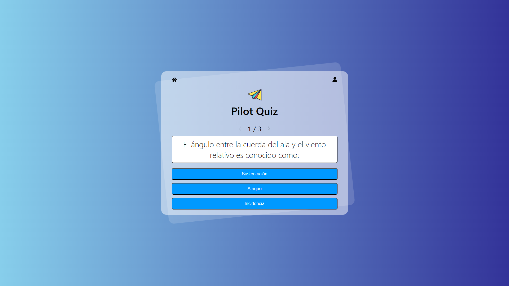

# Quiz Application for ANAC Pilot Exam

This application is designed to help users prepare for the ANAC (Agência Nacional de Aviação Civil) pilot exam by offering a comprehensive quiz experience. The app provides a range of questions that mirror the content and difficulty of the actual exam, allowing users to practice and assess their knowledge in a simulated environment.

## Features

- **Interactive Quiz:** Users can answer multiple-choice questions and receive instant feedback on their performance.
- **Randomized Questions:** Questions are presented in a randomized order to ensure a varied practice experience.
- **Confetti Animation:** A fun confetti animation appears when the user selects the correct answer, adding a celebratory touch to correct responses.
- **Navigation Controls:** Easily move between questions with navigation buttons to go forward or backward.

## Technologies Used

- **React:** The core library for building the user interface and managing component state.
- **TypeScript:** Provides static typing and helps ensure code quality and maintainability.
- **Zustand:** A state management library used to handle the application's state efficiently.
- **LibSQL:** Used for database operations and data storage.